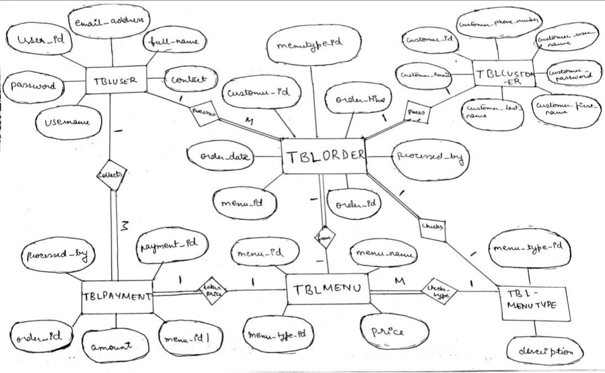
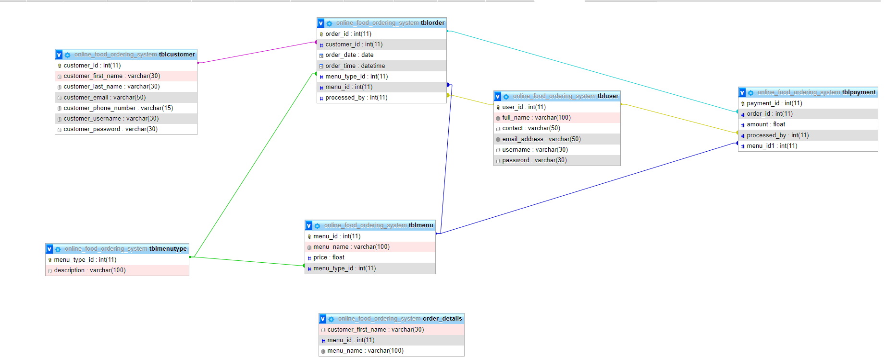

# 🍽️ Online Food Ordering System

## 📌 Abstract

The **Online Food Ordering System** aims to automate the existing manual system through a user-friendly and robust computerized solution. It allows storing, accessing, and managing valuable customer and order data over long periods with ease and security.

The system replaces traditional, error-prone paper-based ordering with a fast, secure, and reliable digital platform. This not only reduces workload but enhances data integrity, user experience, and business efficiency.

Key benefits include:
- Error-free record keeping
- Streamlined order management
- Easy access and manipulation of stored data
- Reduced customer wait times via digital menus and fast processing

---

## 🗃️ Technologies Used

- 📄 **SQL (MySQL)** – For relational database schema, DDL, DML, constraints, views, triggers, and queries
- 🖥️ **Streamlit** 
- 🗂️ ER diagrams and schemas for data modeling

---

## 🔧 Database Structure

### 🧩 Tables & Sample Data
- `tblcustomer` – Stores customer information  
- `tblmenu` – Menu items with prices  
- `tblmenutype` – Categorizes meals into Breakfast, Lunch, Snacks, Dinner  
- `tblorder` – Stores order data  
- `tblpayment` – Tracks payments  
- `tbluser` – Staff/admin users  
- `order_details` – Simple tracking table

### ⚙️ DDL Features
- `CREATE TABLE`, `ALTER TABLE` with primary/foreign keys
- `INDEXES` for performance (`cust_id`, etc.)
- `UPDATE` and `DELETE` queries
- `JOIN` and `SELECT` operations

---

## 📈 ER Diagram



---

## 📊 Relational Schema


```sql
Customer(CustomerID, Name, Email, Phone, Address)

Menu(ItemID, ItemName, Description, Price)

Order(OrderID, CustomerID, OrderDate, TotalAmount)

OrderItems(OrderItemID, OrderID, ItemID, Quantity)
